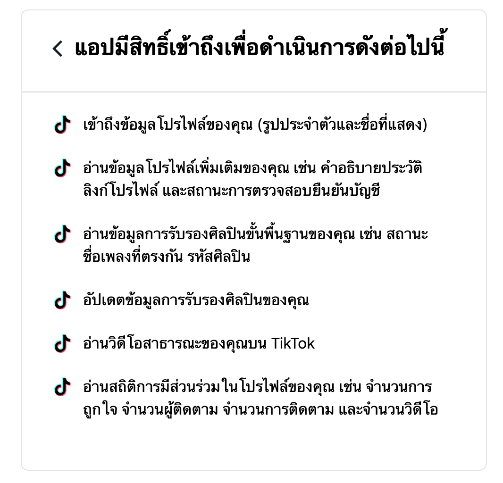

# TikTok API v2 User Object

<style>
    @media print {
        table, pre, code, .highlight { page-break-inside: avoid; }
        tr    { page-break-inside: avoid; page-break-after: auto; }
        thead { display: table-header-group; }
        tfoot { display: table-footer-group; }
        img   { max-width: 100%; page-break-inside: avoid; }
        h2, h3 { page-break-after: avoid; }
    }
</style>

## Overview
The User Object contains information about a TikTok user.

## Scope Mapping

This section maps the permissions shown in the TikTok authorization screen to the corresponding API scopes.



### Mapping Table

| Thai Description | Scope | English Description |
| :--- | :--- | :--- |
| เข้าถึงข้อมูลโปรไฟล์ของคุณ (รูปประจำตัวและชื่อที่แสดง) | `user.info.basic` | Access your profile info (avatar and display name) |
| อ่านข้อมูลโปรไฟล์เพิ่มเติมของคุณ เช่น คำอธิบายประวัติ ลิงก์โปรไฟล์ และสถานะการตรวจสอบยืนยันบัญชี | `user.info.profile` | Read additional profile info (bio, profile link, verified status) |
| อ่านข้อมูลการรับรองศิลปินบนพื้นฐานของคุณ เช่น สถานะการรับรองศิลปิน | `artist.certification.read` | Read your artist certification info |
| อัปเดตข้อมูลการรับรองศิลปินของคุณ | `artist.certification.update` | Update your artist certification info |
| อ่านวิดีโอสาธารณะของคุณบน TikTok | `video.list` | Read your public videos on TikTok |
| อ่านข้อมูลสถิติผู้ใช้ของคุณ เช่น จำนวนผู้ติดตาม จำนวนผู้ติดตาม จำนวนการกดไลก์ และจำนวนวิดีโอ | `user.info.stats` | Read your user statistics (follower count, following count, likes count, video count) |


## Fields

| Field | Type | Description | Authorized Scope |
| :--- | :--- | :--- | :--- |
| `open_id` | string | The unique identification of the user in the current application.<br>รหัสประจำตัวผู้ใช้ที่ไม่ซ้ำกันในแอปพลิเคชันปัจจุบัน | `user.info.basic` |
| `union_id` | string | The unique identification of the user across different apps for the same developer. For example, if a partner has X number of clients, it will get X number of open_id for the same TikTok user, but one persistent union_id for the particular user.<br>รหัสประจำตัวผู้ใช้ที่ไม่ซ้ำกันข้ามแอปต่างๆ สำหรับนักพัฒนาคนเดียวกัน ตัวอย่างเช่น หากพาร์ทเนอร์มีไคลเอนต์ X ตัว จะได้รับ open_id X ตัวสำหรับผู้ใช้ TikTok คนเดียวกัน แต่จะมี union_id เดียวที่ถาวรสำหรับผู้ใช้นั้น | `user.info.basic` |
| `avatar_url` | string | User's profile image.<br>รูปโปรไฟล์ของผู้ใช้ | `user.info.basic` |
| `avatar_url_100` | string | User's profile image in 100x100 size.<br>รูปโปรไฟล์ของผู้ใช้ขนาด 100x100 | `user.info.basic` |
| `avatar_large_url` | string | User's profile image with higher resolution.<br>รูปโปรไฟล์ของผู้ใช้ที่มีความละเอียดสูง | `user.info.basic` |
| `display_name` | string | User's profile name.<br>ชื่อโปรไฟล์ของผู้ใช้ | `user.info.basic` |
| `bio_description` | string | User's bio description if there is a valid one.<br>คำอธิบายประวัติของผู้ใช้ (ถ้ามี) | `user.info.profile` |
| `profile_deep_link` | string | The link to user's TikTok profile page.<br>ลิงก์ไปยังหน้าโปรไฟล์ TikTok ของผู้ใช้ | `user.info.profile` |
| `is_verified` | boolean | Whether TikTok has provided a verified badge to the account after confirming that it belongs to the user it represents.<br>บัญชีนี้ได้รับการยืนยันจาก TikTok หรือไม่ | `user.info.profile` |
| `username` | string | User's username.<br>ชื่อผู้ใช้ (Username) | `user.info.profile` |
| `follower_count` | int64 | User's followers count.<br>จำนวนผู้ติดตาม | `user.info.stats` |
| `following_count` | int64 | The number of accounts that the user is following.<br>จำนวนบัญชีที่ผู้ใช้กำลังติดตาม | `user.info.stats` |
| `likes_count` | int64 | The total number of likes received by the user across all of their videos.<br>จำนวนไลก์ทั้งหมดที่ผู้ใช้ได้รับจากวิดีโอทั้งหมด | `user.info.stats` |
| `video_count` | int64 | The total number of publicly posted videos by the user.<br>จำนวนวิดีโอที่ผู้ใช้โพสต์ต่อสาธารณะ | `user.info.stats` |

## Example Response

```json
{
  "data": {
    "user": {
      "avatar_url": "https://p19-sign.tiktokcdn-us.com/tos-avt-0068-tx/b17f0e4b3a4f4a50993cf72cda8b88b8~c5_168x168.jpeg",
      "open_id": "723f24d7-e717-40f8-a2b6-cb8464cd23b4",
      "union_id": "c9c60f44-a68e-4f5d-84dd-ce22faeb0ba1",
      "display_name": "User Name",
      "follower_count": 100,
      "following_count": 10,
      "likes_count": 50,
      "video_count": 5
    }
  },
  "error": {
    "code": "ok",
    "message": "",
    "log_id": "20220829194722CBE87ED59D524E727021"
  }
}
```

## Reference
[TikTok API v2 Get User Info](https://developers.tiktok.com/doc/tiktok-api-v2-get-user-info?enter_method=left_navigation)
